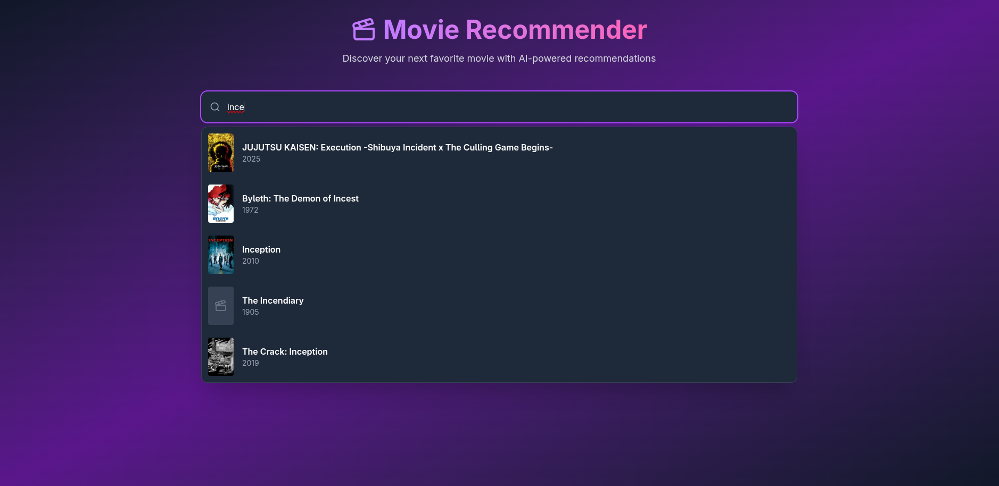
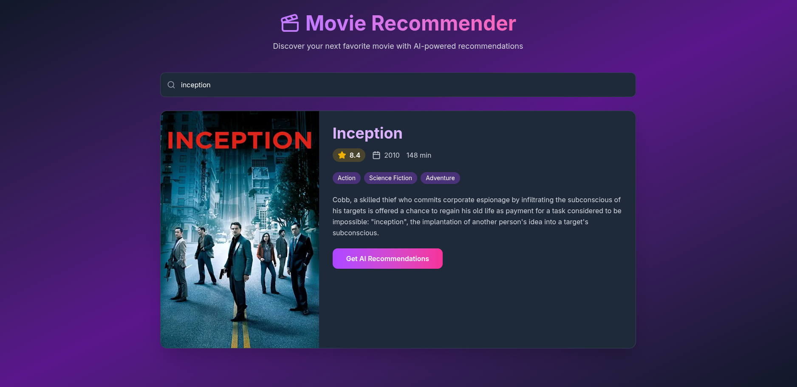
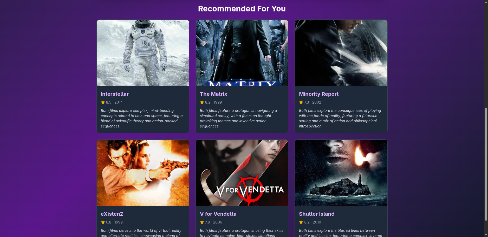

# Movie Recommender App

A web application that allows users to search for movies, explore detailed information, and receive AI-based or genre-based movie recommendations. Built with **Vite + React** on the frontend and **Flask** on the backend, this app leverages **TMDb API** for movie data and optionally **Hugging Face AI models** for personalized recommendations.

---

## Table of Contents

-   [Features](#features)
-   [Screenshots](#screenshots)
-   [Installation & Setup](#installation--setup)
-   [Usage](#usage)
-   [Environment Variables](#environment-variables)
-   [How It Works](#how-it-works)

---

## Features

-   **Search Movies** – Look up any movie in the TMDb database.
-   **Movie Details** – View title, poster, release year, rating, and description.
-   **AI Recommendations** – Generate movie recommendations with a Hugging Face AI model.
-   **Genre Recommendations** – Fall back to TMDb genre search if no AI key is provided.
-   **Recommendation Reasoning** – If AI is used, explanations for why each movie was recommended.

---

## Screenshots

### Home/Search



### Movie Details



### Recommendations



---

## Installation & Setup

### Frontend (Vite + React)

```bash
cd frontend
npm install

# Copy environment file (if needed)
cp .env.example .env
# Edit .env if you want to configure VITE_API_URL

# Start frontend
npm run dev
```

### Backend (Flask)

```bash
cd backend
# Create virtual environment
python -m venv venv
source venv/bin/activate  # Linux/Mac
venv\Scripts\activate     # Windows

# Install dependencies
pip install -r requirements.txt

# Copy environment file
cp .env.example .env
# Edit .env to add your TMDB_API_KEY and optional HUGGINGFACE_API_KEY

# Run the backend
python app.py
```

---

## Usage

1. Open the frontend in your browser (typically at http://localhost:5173).
2. Search for any movie using the search bar.
3. Click a movie to view its details: poster, year, rating, and description.
4. Generate recommendations:
    - With Hugging Face API key: AI-generated recommendations with reasoning.
    - Without Hugging Face API key: TMDb genre-based recommendations.
5. Click on recommended movies to explore their details.

---

## Environment Variables

### Frontend (`frontend/.env`)

```env
VITE_API_URL=http://localhost:5000/api
VITE_TMDB_IMAGE_URL=https://image.tmdb.org/t/p/w500
```

### Backend (`backend/.env`)

```env
TMDB_BASE_URL=https://api.themoviedb.org/3
HF_API_URL=https://router.huggingface.co/v1/chat/completions

TMDB_API_KEY=your-tmdb-api-key
HUGGINGFACE_API_KEY=optional-hf-api-key
```

---

## How It Works

1. User searches a movie → frontend sends request to backend.
2. Backend queries TMDb API for matching movies.
3. User clicks a movie → backend fetches full details from TMDb.
4. User requests recommendations:
    - AI model path: Backend sends movie info to Hugging Face model → gets recommended movies + reasoning → fetches TMDb data for each.
    - Genre path: Backend uses TMDb genre search → fetches movie info.
5. Frontend displays recommended movies with all details.
6. If AI was used, detailed reasoning for each recommendation is shown.
